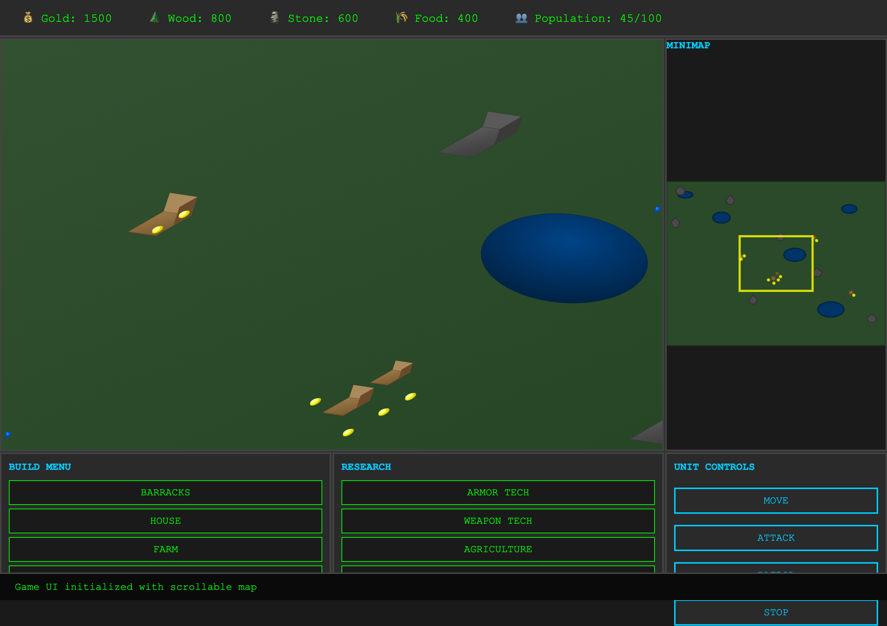

# RTS Game UI Mockup

A web-based real-time strategy (RTS) game UI mockup built with Rust and WebAssembly. This project demonstrates a classic RTS interface with interactive elements but no actual game logic - it's purely a UI demonstration.



## Features

### Game Interface
- **Resource Panel**: Displays Gold, Wood, Stone, Food, and Population counters
- **Main Map**: Interactive SVG map with terrain, water bodies, mountains, buildings, and units
- **Minimap**: Simplified overview with viewport indicator
- **Build Menu**: 8 different building types (Barracks, House, Farm, Mine, Tower, Wall, Gate, Workshop)
- **Research Menu**: 7 technology options (Armor Tech, Weapon Tech, Agriculture, Mining Tech, Construction, Magic Arts, Tactics)
- **Unit Controls**: Move, Attack, Patrol, and Stop commands

### Visual Design
- Retro terminal aesthetic with green-on-black color scheme
- SVG-based graphics for scalable map elements
- Responsive grid layout optimizing screen real estate
- Hover effects and visual feedback for all interactive elements

### Technical Stack
- **Rust**: Core logic and WASM bindings using `wasm-bindgen`
- **WebAssembly**: High-performance web execution
- **HTML5**: Semantic structure with inline CSS3
- **SVG**: Vector graphics for map and minimap
- **Minimal JavaScript**: Only for WASM initialization and event bridging

## Getting Started

### Prerequisites
- [Rust](https://rustup.rs/) (latest stable)
- [wasm-pack](https://rustwasm.github.io/wasm-pack/installer/)

### Building

1. **Clone the repository**
   ```bash
   git clone <repository-url>
   cd rts_mock
   ```

2. **Build the WASM package**
   ```bash
   wasm-pack build --target web --out-dir pkg
   ```

3. **Serve the application**
   ```bash
   # Using basic-http-server (recommended for Rust projects)
   basic-http-server -a 0.0.0.0:8000

   # Using Python
   python -m http.server 8000

   # Using Node.js
   npx serve .
   ```

4. **Open in browser**
   Navigate to `http://localhost:8000` and open `index.html`

## Usage

Click on any UI element to see status messages appear at the bottom of the screen:

- **Map/Minimap**: Click anywhere to see coordinates
- **Resource Panel**: Click on resource counters
- **Build Menu**: Select building types
- **Research Menu**: Choose technologies to research
- **Unit Controls**: Issue commands to selected units

All interactions are logged to both the browser console and the on-screen status display.

## Project Structure

```
rts_mock/
+-- src/
|   +-- lib.rs          # Main WASM module with interaction handlers
|   +-- main.rs         # Original CLI entry point (unused)
+-- docs/               # Documentation
|   +-- overview.md     # Project overview for management
+-- images/             # Screenshots and visual assets
|   +-- screenshot.png  # UI screenshot
+-- pkg/                # Generated WASM output (after build)
+-- index.html          # Main web interface
+-- Cargo.toml          # Rust project configuration
+-- README.md           # This file
```

## Development

### Code Quality
```bash
# Run clippy for linting
cargo clippy

# Format code
cargo fmt

# Run unit tests
cargo test

# Run WASM tests (requires browser)
wasm-pack test --headless --firefox
# or
wasm-pack test --headless --chrome
```

### Architecture

The application uses a clean separation between Rust (logic) and JavaScript (DOM interaction):

- **Rust (`src/lib.rs`)**: Handles all interaction logic and status message generation
- **HTML/CSS**: Defines the complete UI layout and styling
- **JavaScript**: Minimal glue code for WASM initialization and event forwarding

## License

This project is released under the MIT License. See LICENSE file for details.

## Contributing

This is a demonstration project, but contributions are welcome! Please feel free to:

- Report bugs or issues
- Suggest UI improvements
- Add new interactive elements
- Improve the visual design

---

*Built with Rust and WebAssembly*
