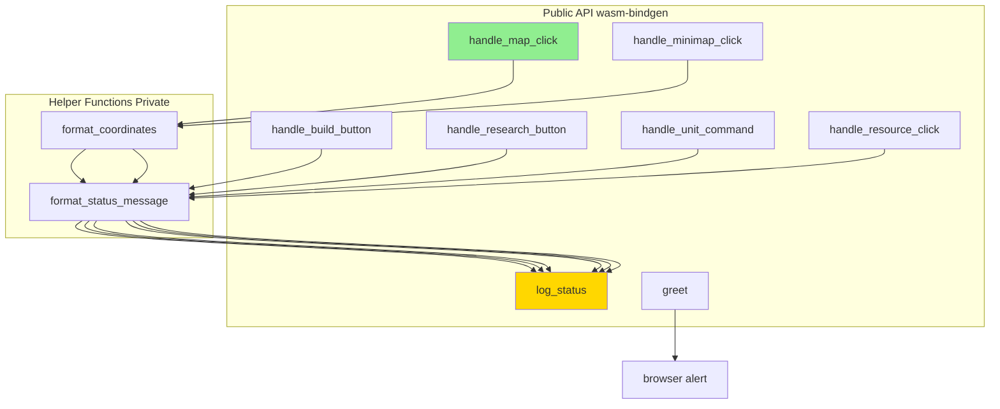
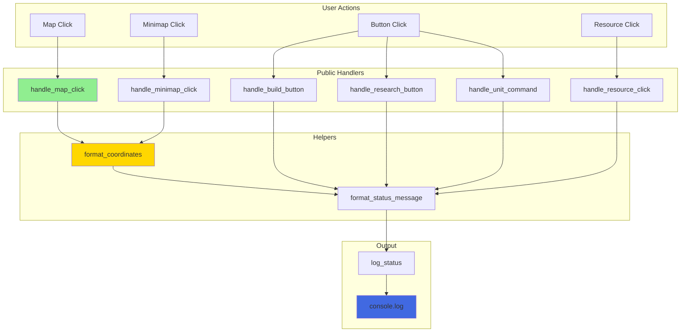

# API Reference

Complete reference documentation for all WASM-exposed functions and helper functions.

## 📚 Function Index



---

## 🌐 Public API Functions

### `handle_map_click(x: f64, y: f64)`

Handles click events on the main map.

**Signature:**
```rust
#[wasm_bindgen]
pub fn handle_map_click(x: f64, y: f64)
```

**Parameters:**
| Parameter | Type | Description |
|-----------|------|-------------|
| `x` | `f64` | World X coordinate |
| `y` | `f64` | World Y coordinate |

**Returns:** `()`

**Behavior:**
1. Formats coordinates as "(x, y)" string
2. Creates status message "Map clicked at: (x, y)"
3. Logs to console with "RTS Status:" prefix

**Example Usage:**

```javascript
// From JavaScript
handle_map_click(1234.5, 678.9);
// Console: "RTS Status: Map clicked at: (1235, 679)"
```

**Notes:**
- Coordinates are rounded to nearest integer
- Negative coordinates are supported
- Handles extreme values (f64::MAX, f64::MIN)

**Related:**
- `handle_minimap_click` - Similar for minimap
- `format_coordinates` - Internal coordinate formatting

**Location:** `src/lib.rs:30-33`

---

### `handle_minimap_click(x: f64, y: f64)`

Handles click events on the minimap.

**Signature:**
```rust
#[wasm_bindgen]
pub fn handle_minimap_click(x: f64, y: f64)
```

**Parameters:**
| Parameter | Type | Description |
|-----------|------|-------------|
| `x` | `f64` | Minimap X coordinate (0-200) |
| `y` | `f64` | Minimap Y coordinate (0-150) |

**Returns:** `()`

**Behavior:**
1. Formats minimap coordinates
2. Creates status message "Minimap clicked at: (x, y)"
3. Logs to console

**Example Usage:**

```javascript
// From JavaScript
handle_minimap_click(100.0, 75.0);
// Console: "RTS Status: Minimap clicked at: (100, 75)"
```

**Notes:**
- Minimap coordinates are smaller scale (1:12 ratio with world map)
- JavaScript layer handles viewport centering
- This function only logs the click

**Related:**
- `handle_map_click` - Main map version
- JavaScript minimap click handler

**Location:** `src/lib.rs:36-39`

---

### `handle_build_button(building_type: &str)`

Handles build menu button clicks.

**Signature:**
```rust
#[wasm_bindgen]
pub fn handle_build_button(building_type: &str)
```

**Parameters:**
| Parameter | Type | Description |
|-----------|------|-------------|
| `building_type` | `&str` | Building type identifier |

**Returns:** `()`

**Valid Building Types:**
- `"barracks"` - Unit training building
- `"house"` - Population increase
- `"farm"` - Food production
- `"mine"` - Resource gathering
- `"tower"` - Defense structure
- `"wall"` - Fortification
- `"gate"` - Entry point
- `"workshop"` - Advanced units

**Behavior:**
1. Creates message "Build: {building_type} selected"
2. Logs to console

**Example Usage:**

```javascript
// From HTML onclick
handleBuildButton('barracks');
// Console: "RTS Status: Build: barracks selected"
```

**Notes:**
- Accepts any string (not validated)
- Empty strings are handled gracefully
- No actual building construction occurs (UI mockup)

**Related:**
- `handle_research_button` - Similar for research

**Location:** `src/lib.rs:42-45`

---

### `handle_research_button(tech: &str)`

Handles research menu button clicks.

**Signature:**
```rust
#[wasm_bindgen]
pub fn handle_research_button(tech: &str)
```

**Parameters:**
| Parameter | Type | Description |
|-----------|------|-------------|
| `tech` | `&str` | Technology identifier |

**Returns:** `()`

**Valid Technologies:**
- `"armor"` - Armor Tech
- `"weapons"` - Weapon Tech
- `"agriculture"` - Agriculture
- `"mining"` - Mining Tech
- `"construction"` - Construction
- `"magic"` - Magic Arts
- `"tactics"` - Tactics

**Behavior:**
1. Creates message "Research: {tech} selected"
2. Logs to console

**Example Usage:**

```javascript
// From HTML onclick
handleResearchButton('armor');
// Console: "RTS Status: Research: armor selected"
```

**Notes:**
- Similar to `handle_build_button`
- No research progress tracking
- Any string accepted

**Related:**
- `handle_build_button` - Similar for buildings

**Location:** `src/lib.rs:48-51`

---

### `handle_unit_command(command: &str)`

Handles unit control button clicks.

**Signature:**
```rust
#[wasm_bindgen]
pub fn handle_unit_command(command: &str)
```

**Parameters:**
| Parameter | Type | Description |
|-----------|------|-------------|
| `command` | `&str` | Unit command identifier |

**Returns:** `()`

**Valid Commands:**
- `"move"` - Move units
- `"attack"` - Attack command
- `"patrol"` - Patrol route
- `"stop"` - Stop current action

**Behavior:**
1. Creates message "Unit command: {command}"
2. Logs to console

**Example Usage:**

```javascript
// From HTML onclick
handleUnitCommand('attack');
// Console: "RTS Status: Unit command: attack"
```

**Notes:**
- Simpler format than build/research (no "selected" suffix)
- No actual unit commands executed
- Commands displayed with cyan styling in UI

**Related:**
- Unit control panel in HTML

**Location:** `src/lib.rs:54-57`

---

### `handle_resource_click(resource: &str)`

Handles resource panel clicks.

**Signature:**
```rust
#[wasm_bindgen]
pub fn handle_resource_click(resource: &str)
```

**Parameters:**
| Parameter | Type | Description |
|-----------|------|-------------|
| `resource` | `&str` | Resource type identifier |

**Returns:** `()`

**Valid Resources:**
- `"gold"` - Gold resource
- `"wood"` - Wood resource
- `"stone"` - Stone resource
- `"food"` - Food resource
- `"population"` - Population counter

**Behavior:**
1. Creates message "Resource panel clicked: {resource}"
2. Logs to console

**Example Usage:**

```javascript
// From HTML onclick
handleResourceClick('gold');
// Console: "RTS Status: Resource panel clicked: gold"
```

**Notes:**
- In full RTS game, might open resource details
- Currently just logs interaction
- Resource values are static in HTML

**Related:**
- Resource panel component

**Location:** `src/lib.rs:60-63`

---

### `log_status(message: &str)`

Logs a status message to the console.

**Signature:**
```rust
#[wasm_bindgen]
pub fn log_status(message: &str)
```

**Parameters:**
| Parameter | Type | Description |
|-----------|------|-------------|
| `message` | `&str` | Message to log |

**Returns:** `()`

**Behavior:**
1. Prepends "RTS Status: " to message
2. Calls `web_sys::console::log_1()`
3. JavaScript intercepts and updates status display

**Example Usage:**

```rust
// From Rust
log_status("Game initialized");
// Console: "RTS Status: Game initialized"
```

```javascript
// From JavaScript (after import)
log_status("Custom message");
```

**Notes:**
- Used internally by all handler functions
- JavaScript overrides `console.log` to capture these messages
- Messages appear in both console and status display

**Related:**
- All handler functions use this for logging
- JavaScript console override in `index.html`

**Location:** `src/lib.rs:25-27`

---

### `greet(name: &str)`

Demo function showing alert interop (not used in UI).

**Signature:**
```rust
#[wasm_bindgen]
pub fn greet(name: &str)
```

**Parameters:**
| Parameter | Type | Description |
|-----------|------|-------------|
| `name` | `&str` | Name to greet |

**Returns:** `()`

**Behavior:**
1. Creates greeting message
2. Calls browser `alert()` API
3. Displays modal alert dialog

**Example Usage:**

```javascript
greet("World");
// Browser shows alert: "Hello, World!"
```

**Notes:**
- Not used in the actual UI
- Demonstrates WASM → browser API calls
- Used in WASM tests
- Alert is blocking (pauses execution)

**Related:**
- WASM test: `test_greet_wasm`

**Location:** `src/lib.rs:20-22`

---

## 🔧 Helper Functions (Internal)

### `format_status_message(prefix: &str, details: &str) -> String`

Formats a status message with consistent structure.

**Signature:**
```rust
fn format_status_message(prefix: &str, details: &str) -> String
```

**Parameters:**
| Parameter | Type | Description |
|-----------|------|-------------|
| `prefix` | `&str` | Message category/prefix |
| `details` | `&str` | Specific details |

**Returns:** `String` - Formatted message

**Format:** `"{prefix}: {details}"`

**Example:**

```rust
format_status_message("Build", "barracks selected")
// Returns: "Build: barracks selected"

format_status_message("Map clicked at", "(100, 200)")
// Returns: "Map clicked at: (100, 200)"
```

**Notes:**
- Simple string concatenation with colon separator
- Used by all handler functions
- Ensures consistent message format

**Tests:**
- `test_format_status_message` - Basic functionality

**Location:** `src/lib.rs:10-12`

---

### `format_coordinates(x: f64, y: f64) -> String`

Formats coordinates as a human-readable string.

**Signature:**
```rust
fn format_coordinates(x: f64, y: f64) -> String
```

**Parameters:**
| Parameter | Type | Description |
|-----------|------|-------------|
| `x` | `f64` | X coordinate |
| `y` | `f64` | Y coordinate |

**Returns:** `String` - Formatted coordinates

**Format:** `"({x:.0}, {y:.0})"` (rounded to integers)

**Examples:**

```rust
format_coordinates(123.45, 678.90)
// Returns: "(123, 679)"

format_coordinates(0.0, 0.0)
// Returns: "(0, 0)"

format_coordinates(-10.5, -20.8)
// Returns: "(-10, -21)"

format_coordinates(f64::MAX, f64::MIN)
// Returns: large integer strings
```

**Rounding Behavior:**
- Uses `{:.0}` format specifier
- Rounds to nearest integer
- Standard rounding rules (.5 rounds up)

**Tests:**
- `test_format_coordinates` - Normal values
- `test_format_coordinates_zero` - Zero case
- `test_format_coordinates_negative` - Negative values

**Location:** `src/lib.rs:15-17`

---

## 📊 Function Call Graph



---

## 🔄 Data Type Reference

### JavaScript → Rust Type Mapping

| JavaScript | Rust | Notes |
|------------|------|-------|
| `number` | `f64` | Coordinates, floating point |
| `string` | `&str` | Text parameters (borrowed) |
| `string` (return) | `String` | Owned strings returned to JS |
| `undefined` | `()` | Void return type |

### Rust → JavaScript Type Mapping

| Rust | JavaScript | Notes |
|------|------------|-------|
| `f64` | `number` | IEEE 754 float |
| `&str` | `string` | UTF-8 text |
| `String` | `string` | Owned string |
| `()` | `undefined` | No return value |

### wasm-bindgen Attributes

```rust
// Export to JavaScript
#[wasm_bindgen]
pub fn function_name() { }

// Import from JavaScript
#[wasm_bindgen]
extern "C" {
    fn alert(s: &str);
}
```

---

## ⚡ Performance Notes

### Function Call Overhead

| Call Type | Overhead | Notes |
|-----------|----------|-------|
| **JS → WASM** | ~10-50 ns | Fast, near-native |
| **WASM → JS (console)** | ~1-10 μs | DOM/API calls slower |
| **String allocation** | ~100-500 ns | For format! macro |

### Optimization Tips

✅ **Fast:**
- Numeric parameters (f64)
- Short string literals
- Borrowed strings (&str)

⚠️ **Slower:**
- Large string allocations
- Frequent DOM updates
- Multiple WASM → JS calls

**Example - Optimized:**
```rust
#[wasm_bindgen]
pub fn handle_click(x: f64, y: f64) {  // Fast: borrowed params
    let msg = format_coordinates(x, y);  // Single allocation
    log_status(&msg);  // Single WASM→JS call
}
```

**Example - Not Optimized:**
```rust
// Multiple separate calls = slower
log_status("x:");
log_status(&x.to_string());
log_status("y:");
log_status(&y.to_string());
```

---

## 🔗 Related Pages

- **[Development Guide](Development-Guide)** - Usage examples
- **[Architecture](Architecture)** - System design
- **[Testing](Testing)** - Test coverage
- **[Interaction Flows](Interaction-Flows)** - Call sequences

---

[← Back to Home](Home)
