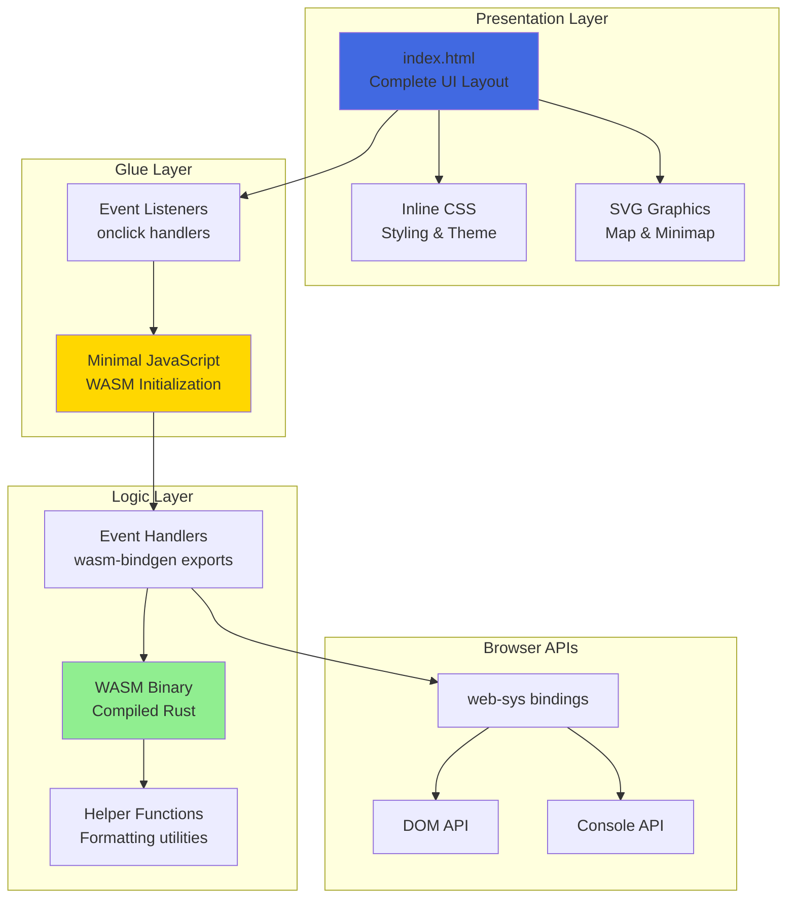
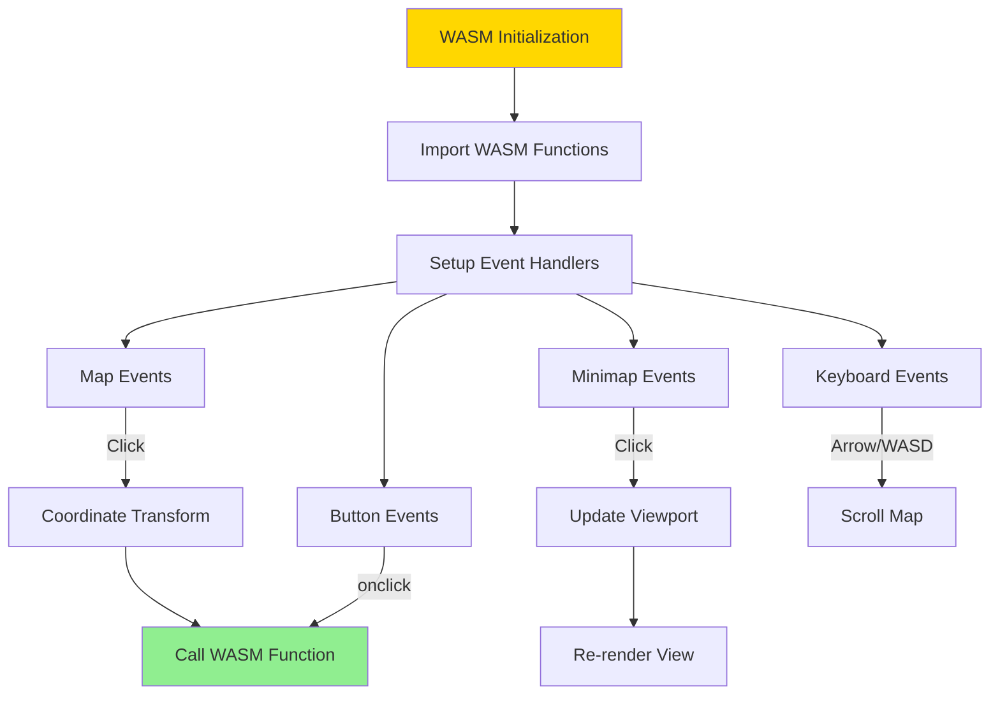
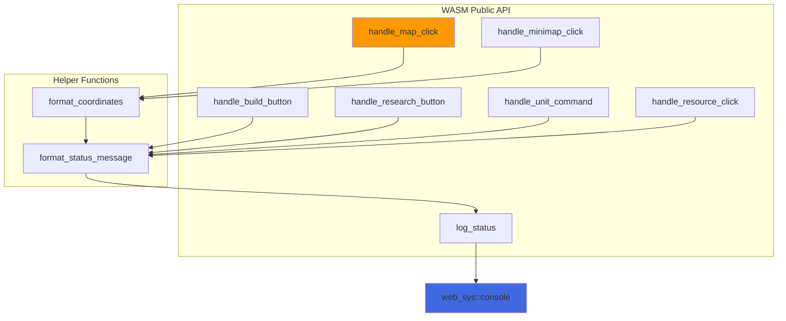
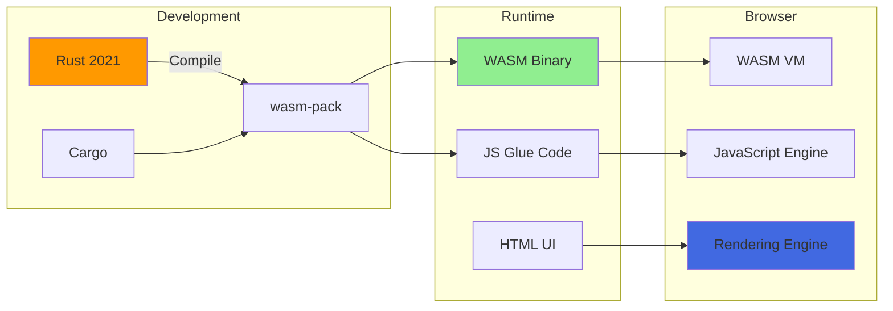
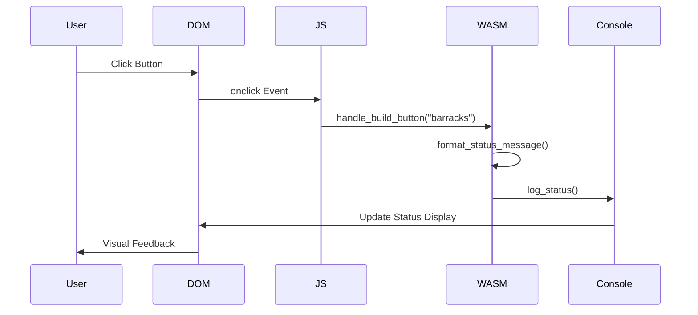
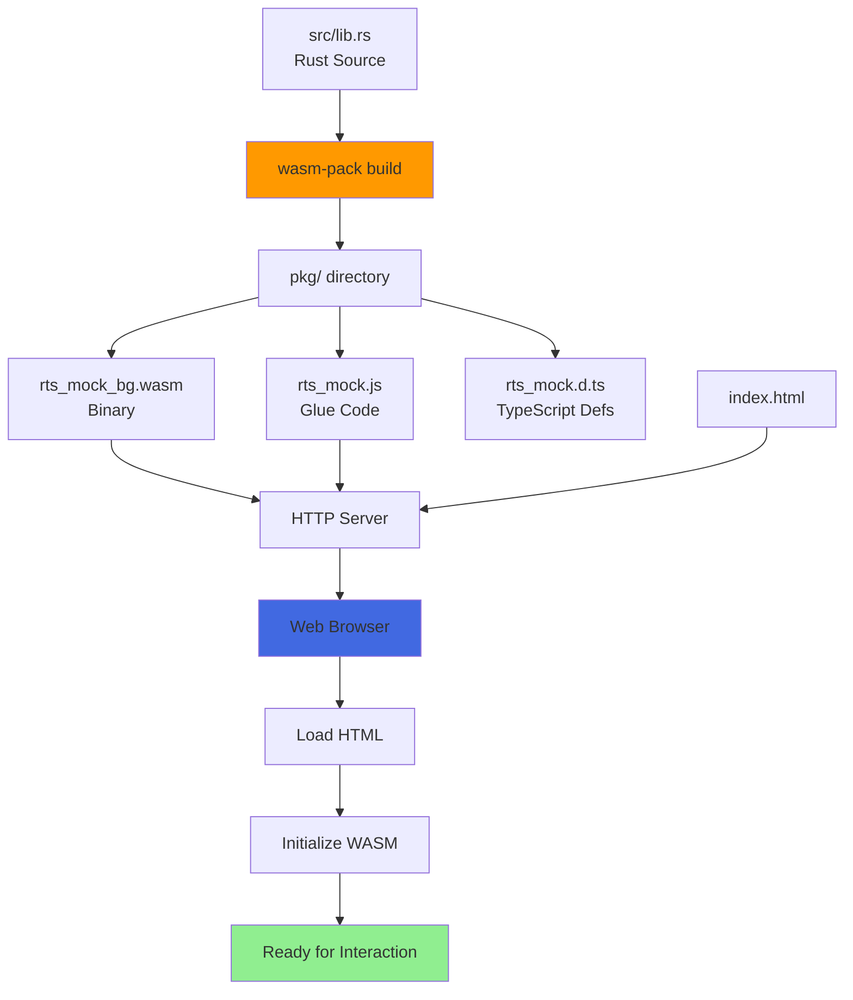

# Architecture

This page describes the high-level architecture of the RTS Mock project, including system design, technology stack, and architectural patterns.

## 📐 High-Level Architecture

The RTS Mock follows a **clean separation of concerns** architecture with three distinct layers:



---

## 🏛️ Architectural Layers

### 1. Presentation Layer (HTML/CSS/SVG)

**Location:** `index.html`

**Responsibilities:**
- Define complete UI structure and layout
- Provide visual styling (retro terminal aesthetic)
- Render SVG graphics for maps
- Display static content

**Key Design Decisions:**
- ✅ All styling is **inline** in `index.html` (no separate CSS files)
- ✅ Uses **CSS Grid** for responsive layout
- ✅ SVG for scalable graphics
- ✅ Fixed positioning for overlays (status, footer)

```mermaid
graph LR
    subgraph "UI Layout CSS Grid"
        RES[Resource Panel]
        MAP[Main Map SVG]
        MINI[Minimap SVG]
        BUILD[Build Menu]
        RSRCH[Research Menu]
        CTRL[Unit Controls]
        STATUS[Status Display]
        FOOTER[Footer]
    end

    RES --> |Grid Area: resources| GRID[Grid Container]
    MAP --> |Grid Area: map| GRID
    MINI --> |Grid Area: minimap| GRID
    BUILD --> |Grid Area: build| GRID
    RSRCH --> |Grid Area: research| GRID
    CTRL --> |Grid Area: controls| GRID
    STATUS --> |Fixed: bottom 30px| GRID
    FOOTER --> |Fixed: bottom 0| GRID

    style GRID fill:#333333
```



### 2. Glue Layer (JavaScript)

**Location:** `index.html` (inline `<script type="module">`)

**Responsibilities:**
- Initialize WASM module
- Set up event handlers
- Manage map viewport state
- Handle coordinate transformations
- Provide keyboard controls

**Key Design Decisions:**
- ✅ **Minimal JavaScript** - only what's necessary for WASM/DOM bridging
- ✅ Map state management kept in JS (viewport position, dragging state)
- ✅ Coordinate transformation for isometric projection
- ✅ Edge scrolling and keyboard navigation



### 3. Logic Layer (Rust/WASM)

**Location:** `src/lib.rs`

**Responsibilities:**
- Handle all UI interactions
- Format status messages
- Coordinate formatting
- Expose public API via `wasm-bindgen`

**Key Design Decisions:**
- ✅ **No state management** - purely reactive to events
- ✅ All public functions exposed via `#[wasm_bindgen]`
- ✅ Helper functions for message formatting
- ✅ Console logging for status updates



---

## 🔧 Technology Stack Details

### Core Technologies



### Dependencies

**Rust Dependencies (`Cargo.toml`):**

| Crate | Version | Purpose |
|-------|---------|---------|
| `wasm-bindgen` | Latest | Rust ↔ JavaScript interop |
| `web-sys` | Latest | Browser API bindings |
| `wasm-bindgen-test` | Latest | WASM testing framework |

**Build Tools:**

- **wasm-pack** - WASM compilation and packaging
- **cargo** - Rust build system and package manager

---

## 🎨 Design Patterns

### 1. Event-Driven Architecture

All user interactions follow an event-driven pattern:



### 2. Separation of Concerns

**Clear boundaries between layers:**

| Layer | Technology | Responsibility |
|-------|-----------|----------------|
| **Presentation** | HTML/CSS/SVG | Structure & Styling |
| **Interaction** | JavaScript | Event Handling & State |
| **Logic** | Rust/WASM | Business Logic |
| **Output** | web-sys | Console & DOM Updates |

### 3. Functional Composition

Helper functions compose to build complex behaviors:

```rust
// Low-level helpers
format_coordinates(x, y) -> String
format_status_message(prefix, details) -> String

// High-level handlers
handle_map_click(x, y) {
    message = format_status_message("Map clicked at", format_coordinates(x, y))
    log_status(message)
}
```

---

## 📦 File Structure

```
rts_mock/
├── src/
│   ├── lib.rs              # Main WASM module
│   │   ├── Public API (wasm-bindgen exports)
│   │   ├── Helper functions
│   │   ├── Unit tests
│   │   └── WASM tests
│   └── main.rs             # Unused (CLI entry point)
│
├── pkg/                    # Generated WASM output
│   ├── rts_mock.js         # JS glue code
│   ├── rts_mock_bg.wasm    # WASM binary
│   └── rts_mock.d.ts       # TypeScript definitions
│
├── index.html              # Complete UI
│   ├── HTML structure
│   ├── Inline CSS
│   ├── SVG graphics
│   └── Inline JavaScript
│
├── docs/
│   ├── overview.md         # Project overview
│   └── claude-web-research-preview-notes.md
│
├── wiki/                   # Wiki pages (this documentation)
│
├── Cargo.toml              # Rust dependencies
├── CLAUDE.md               # Development guidance
├── README.md               # User documentation
└── LICENSE                 # MIT License
```

---

## 🔄 Build & Deployment Flow



**Build Command:**
```bash
wasm-pack build --target web --out-dir pkg
```

**Output:**
- `pkg/rts_mock_bg.wasm` - Compiled WASM binary
- `pkg/rts_mock.js` - JavaScript glue code
- `pkg/rts_mock.d.ts` - TypeScript type definitions
- `pkg/package.json` - NPM package metadata

---

## 🚀 Performance Characteristics

### Advantages of WASM Architecture

✅ **Fast Execution**
- Native-speed computation for event handlers
- Efficient string formatting and manipulation

✅ **Small Binary Size**
- Minimal logic = minimal WASM size
- No heavy dependencies

✅ **Type Safety**
- Rust's type system catches errors at compile time
- `wasm-bindgen` ensures correct JS ↔ WASM communication

✅ **Memory Safety**
- Rust guarantees memory safety without GC overhead
- No memory leaks from logic layer

### Current Limitations

⚠️ **No State Persistence**
- All state is ephemeral (resets on page reload)
- No local storage or server communication

⚠️ **Minimal Logic**
- This is a UI mockup - no actual game logic
- All interactions just log status messages

⚠️ **Inline Styles**
- CSS is inline in HTML (maintainability tradeoff)
- Intentional design choice for simplicity

---

## 🔗 Related Pages

- **[Components](Components)** - Detailed component breakdown
- **[Interaction Flows](Interaction-Flows)** - Sequence diagrams
- **[Data Flow](Data-Flow)** - Data movement patterns
- **[Development Guide](Development-Guide)** - Build and deploy instructions

---

[← Back to Home](Home)
