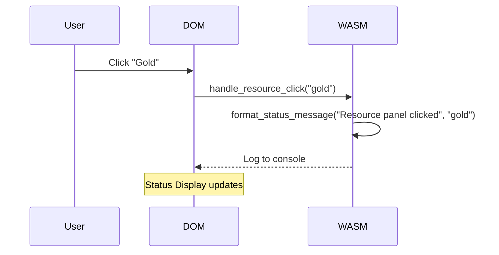
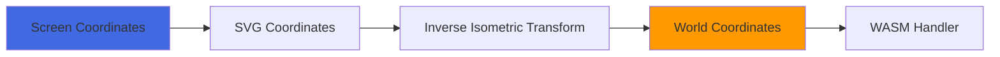
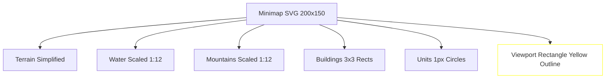
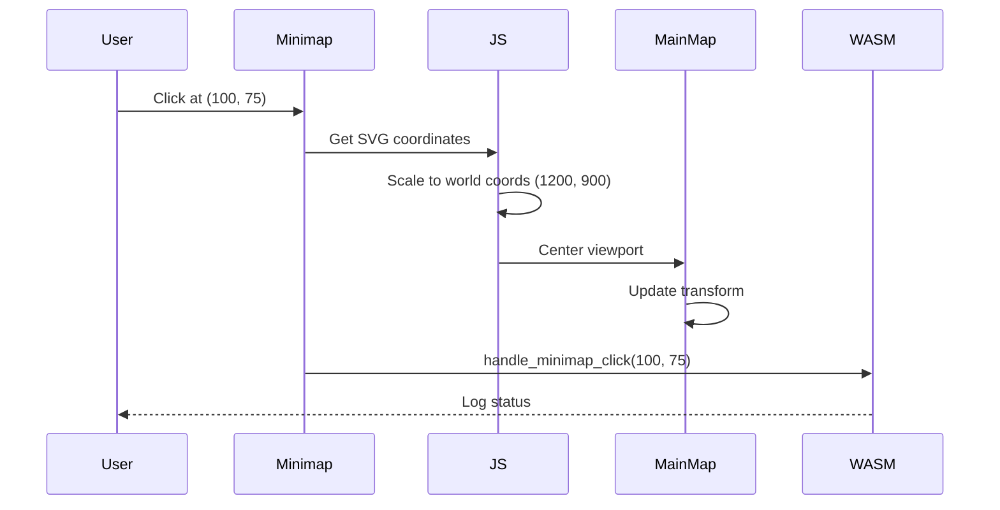
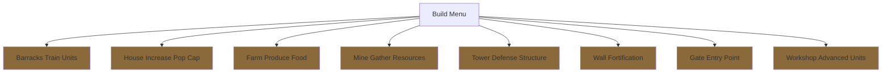
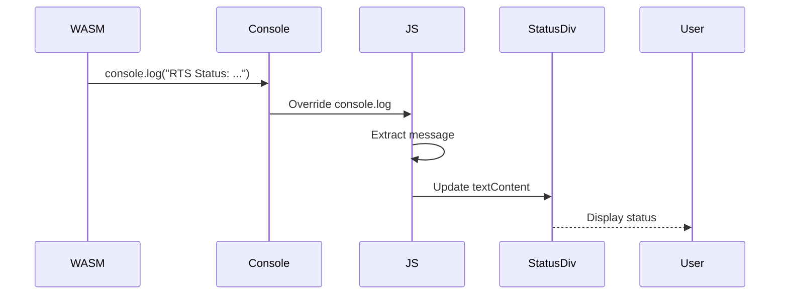

# Components

This page provides detailed documentation for each UI component in the RTS Mock project.

## 📦 Component Overview

The RTS Mock UI consists of 8 main components organized using CSS Grid:

```mermaid
graph TB
    subgraph "Game Container CSS Grid"
        RES[1. Resource Panel Top Bar]
        MAP[2. Main Map Center-Left Large]
        MINI[3. Minimap Top-Right]
        BUILD[4. Build Menu Bottom-Left]
        RSRCH[5. Research Menu Bottom-Center]
        CTRL[6. Unit Controls Bottom-Right]
    end

    STATUS[7. Status Display Fixed Bottom+30px]
    FOOTER[8. Footer Fixed Bottom]

    RES -.-> STATUS
    MAP -.-> STATUS
    MINI -.-> STATUS
    BUILD -.-> STATUS
    RSRCH -.-> STATUS
    CTRL -.-> STATUS

    style RES fill:#2a4a2a
    style MAP fill:#1a3a1a
    style MINI fill:#1a3a1a
    style BUILD fill:#2a2a2a
    style RSRCH fill:#2a2a2a
    style CTRL fill:#2a2a2a
    style STATUS fill:#0a0a0a
    style FOOTER fill:#1a1a1a
```



---

## 1️⃣ Resource Panel

**Location:** `index.html:243-259`
**Grid Area:** `resources`
**Dimensions:** Full width × 50px height

### Purpose
Displays current resource counts for the player. In a real RTS game, this would show dynamic values that update as resources are collected or spent.

### Visual Structure

```
┌─────────────────────────────────────────────────────────────────────┐
│ 💰 Gold: 1500  🌲 Wood: 800  🗿 Stone: 600  🌾 Food: 400  👥 Pop: 45/100 │
└─────────────────────────────────────────────────────────────────────┘
```

### Resources Displayed

| Resource | Icon | Initial Value | Purpose (in full RTS) |
|----------|------|---------------|----------------------|
| **Gold** | 💰 | 1500 | Currency for units/buildings |
| **Wood** | 🌲 | 800 | Construction material |
| **Stone** | 🗿 | 600 | Advanced buildings |
| **Food** | 🌾 | 400 | Unit maintenance |
| **Population** | 👥 | 45/100 | Current/Maximum units |

### Interactions

**Event:** Click on any resource
**Handler:** `handle_resource_click(resource: &str)`
**Response:** Logs "Resource panel clicked: {resource}"



### Styling

- **Background:** `#2a2a2a` (dark gray)
- **Text Color:** `#00ff00` (bright green)
- **Font:** `Courier New, monospace`
- **Hover Effect:** Background changes to `#444`

---

## 2️⃣ Main Map

**Location:** `index.html:261-453`
**Grid Area:** `map`
**Dimensions:** Flexible (takes available space)

### Purpose
Primary game view displaying terrain, buildings, units, and resources in an isometric 3D perspective.

### Map Structure

```mermaid
graph TD
    SVG[SVG Canvas 800x600] --> TERRAIN[Terrain Base Layer]
    SVG --> WATER[Water Bodies]
    SVG --> MOUNTAINS[Mountain Blocks]
    SVG --> RESOURCES[Resource Nodes]
    SVG --> BUILDINGS[Buildings]
    SVG --> UNITS[Units]

    TERRAIN --> |Fill| TERRAIN_GRAD[Terrain Gradient]
    WATER --> |Fill| WATER_GRAD[Water Gradient]
    MOUNTAINS --> |3D Isometric| MTN_POLY[Polygon Blocks]
    RESOURCES --> |Crystals| RES_POLY[Crystal Shapes]
    BUILDINGS --> |3D Isometric| BLD_POLY[Building Blocks]
    UNITS --> |Ellipses| UNIT_SHAPE[Unit Markers]

    style SVG fill:#1a1a1a
```



### Map Elements

#### Terrain
- **Type:** Large rectangle background
- **Size:** 2400 × 1800 (scrollable)
- **Gradient:** Green shades (#3a5a3a → #2a4a2a → #1a3a1a)
- **Purpose:** Base layer representing land

#### Water Bodies (5 instances)
- **Shape:** Ellipses
- **Gradient:** Blue radial (#004488 → #003366 → #002244)
- **Locations:** Scattered across map
- **Purpose:** Impassable terrain features

#### Mountains (7 instances)
- **Shape:** Isometric 3D blocks (polygons)
- **Components:** Top face, front face, side face
- **Colors:** Gray gradients (#6a6a6a → #4a4a4a → #333)
- **Purpose:** Elevated terrain obstacles

#### Resource Nodes (9 instances)
- **Shape:** Isometric crystals
- **Gradient:** Blue radial (#0088ff → #0066ff → #0044cc)
- **Purpose:** Harvestable resources

#### Buildings (5 instances)
- **Shape:** Isometric structures with 3 faces
- **Gradient:** Brown/tan (#aa8a5a → #8a6a3a → #6a4a2a)
- **Purpose:** Player structures

#### Units (8 instances)
- **Shape:** Rotated ellipses
- **Gradient:** Yellow radial (#ffff88 → #ffff00 → #cccc00)
- **Purpose:** Controllable game units

### Coordinate System

**Viewport:**
- Visible area: 800 × 600
- World map: 2400 × 1800
- Starting position: (800, 600) - centered

**Transformation Matrix:**
```javascript
matrix(1, 0.15, -0.3, 0.9, 200, 50)
// Provides gentle isometric skew
```

### Interactions

#### 1. Map Click
**Event:** Click on map
**Handler:** `handle_map_click(x: f64, y: f64)`
**Coordinate Conversion:** Screen → SVG → Isometric → World



#### 2. Map Dragging
**Event:** Mouse down + drag
**Effect:** Pans viewport across world map
**State:** Managed in JavaScript

#### 3. Edge Scrolling
**Event:** Mouse near edge (50px threshold)
**Effect:** Auto-scrolls map at 20px/frame
**Directions:** All four edges

#### 4. Keyboard Navigation
**Keys:** Arrow keys or WASD
**Step:** 40px per press
**Handler:** JavaScript keydown listener

### Styling

- **Background:** Linear gradient `#0a0a0a → #1a1a1a → #0a0a0a`
- **Border:** 2px solid `#444`
- **Cursor:**
  - Default: `grab`
  - While dragging: `grabbing`

---

## 3️⃣ Minimap

**Location:** `index.html:455-497`
**Grid Area:** `minimap`
**Dimensions:** 300px width (fixed)

### Purpose
Provides overview of entire map with viewport indicator. Clicking navigates main map.

### Structure



### Coordinate Scaling

**Conversion:** Main Map → Minimap

```javascript
scaleX = 200 / 2400  // 0.0833
scaleY = 150 / 1800  // 0.0833
minimapX = worldX * scaleX
minimapY = worldY * scaleY
```

### Viewport Indicator

- **Shape:** Rectangle
- **Color:** Yellow (`#ffff00`)
- **Stroke:** 2px
- **Opacity:** 0.8
- **Clickable:** Yes - centers main map on clicked position

### Interactions

**Event:** Click on minimap
**Handler:** `handle_minimap_click(x: f64, y: f64)`
**Effect:**
1. Logs minimap coordinates
2. Centers main map viewport on clicked position



### Styling

- **Background:** `#1a1a1a` (dark)
- **Border:** 2px solid `#444`
- **Title:** "MINIMAP" in cyan (`#00ccff`)

---

## 4️⃣ Build Menu

**Location:** `index.html:499-509`
**Grid Area:** `build`
**Dimensions:** Variable width × 200px height

### Purpose
Interface for selecting building types to construct.

### Building Types



### Interactions

**Event:** Click building button
**Handler:** `handle_build_button(building_type: &str)`
**Response:** Logs "Build: {building_type} selected"

### Button Styling

- **Background:** `#1a1a1a`
- **Text Color:** `#00ff00`
- **Border:** 1px solid `#00ff00`
- **Hover:**
  - Background: `#00ff00`
  - Text: `#1a1a1a`
  - Glow: `0 0 10px #00ff00`

---

## 5️⃣ Research Menu

**Location:** `index.html:511-520`
**Grid Area:** `research`
**Dimensions:** Variable width × 200px height

### Purpose
Interface for selecting technologies to research.

### Technology Tree

| Technology | Purpose (in full RTS) |
|------------|----------------------|
| **Armor Tech** | Increase unit defense |
| **Weapon Tech** | Increase unit attack |
| **Agriculture** | Faster food production |
| **Mining Tech** | Faster resource gathering |
| **Construction** | Faster building |
| **Magic Arts** | Unlock special abilities |
| **Tactics** | Improve unit formations |

### Interactions

**Event:** Click research button
**Handler:** `handle_research_button(tech: &str)`
**Response:** Logs "Research: {tech} selected"

### Styling
Same as Build Menu buttons.

---

## 6️⃣ Unit Controls

**Location:** `index.html:522-528`
**Grid Area:** `controls`
**Dimensions:** 300px width × 200px height

### Purpose
Commands for selected units.

### Commands

```mermaid
graph LR
    CONTROLS[Unit Controls] --> MOVE[MOVE Navigate Units]
    CONTROLS --> ATTACK[ATTACK Engage Enemies]
    CONTROLS --> PATROL[PATROL Auto Patrol Route]
    CONTROLS --> STOP[STOP Halt Actions]

    style MOVE fill:#2a2a2a,stroke:#00ccff
    style ATTACK fill:#2a2a2a,stroke:#00ccff
    style PATROL fill:#2a2a2a,stroke:#00ccff
    style STOP fill:#2a2a2a,stroke:#00ccff
```



### Interactions

**Event:** Click command button
**Handler:** `handle_unit_command(command: &str)`
**Response:** Logs "Unit command: {command}"

### Button Styling (Different from Build/Research)

- **Background:** `#2a2a2a`
- **Text Color:** `#00ccff` (cyan)
- **Border:** 2px solid `#00ccff`
- **Hover:**
  - Background: `#00ccff`
  - Text: `#1a1a1a`
  - Glow: `0 0 10px #00ccff`

---

## 7️⃣ Status Display

**Location:** `index.html:531-533`
**Position:** Fixed, bottom 30px
**Dimensions:** Full width × ~40px height

### Purpose
Shows status messages from all interactions.

### Update Mechanism



### Styling

- **Background:** `#0a0a0a` (very dark)
- **Text Color:** `#00ff00` (bright green)
- **Border Top:** 2px solid `#444`
- **Font Size:** 14px
- **z-index:** 1000 (above footer)

---

## 8️⃣ Footer

**Location:** `index.html:535-541`
**Position:** Fixed, bottom 0
**Dimensions:** Full width × 30px height

### Purpose
Displays copyright, license, and GitHub links.

### Content

```
Copyright © 2025 Michael A. Wright  |  MIT License  |  GitHub Repository
```

### Links

1. **MIT License** → Opens `LICENSE` file in new tab
2. **GitHub Repository** → Opens `https://github.com/softwarewrighter/rts_mock`

### Styling

- **Background:** `#1a1a1a`
- **Text Color:** `#00cc00` (green)
- **Font Size:** 11px
- **Link Color:** `#00ff00`
- **Link Hover:** `#00ffff` (cyan) + underline
- **z-index:** 999 (below status)

---

## 🎨 Component Theming

All components follow the **retro terminal aesthetic**:

### Color Palette

| Color | Hex | Usage |
|-------|-----|-------|
| **Bright Green** | `#00ff00` | Primary text, buttons |
| **Dark Green** | `#00cc00` | Secondary text |
| **Cyan** | `#00ccff` | Accents, unit controls |
| **Very Dark** | `#0a0a0a` | Status background |
| **Dark Gray** | `#1a1a1a` | Main background |
| **Medium Gray** | `#2a2a2a` | Panel backgrounds |
| **Border Gray** | `#444` | Borders and separators |

### Typography

- **Font Family:** `Courier New, monospace`
- **Font Sizes:**
  - Body: 14px
  - Titles: 14px (uppercase)
  - Footer: 11px

---

## 🔗 Related Pages

- **[Architecture](Architecture)** - System design
- **[Interaction Flows](Interaction-Flows)** - Event sequences
- **[Data Flow](Data-Flow)** - Data movement
- **[Development Guide](Development-Guide)** - Implementation details

---

[← Back to Home](Home)
