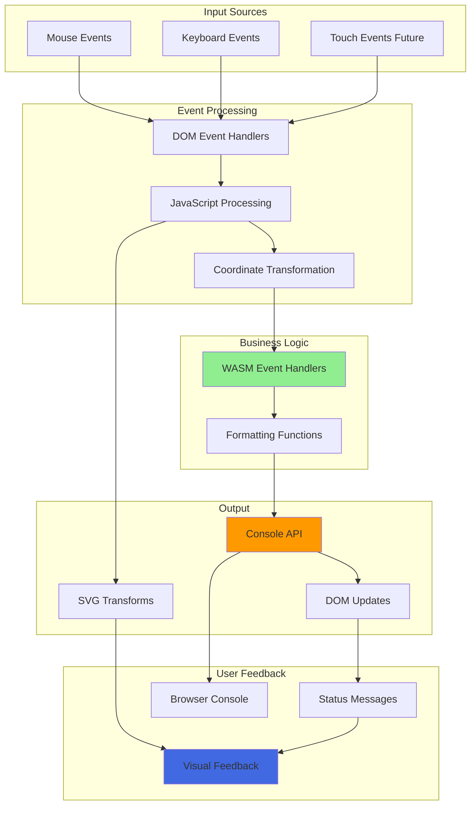
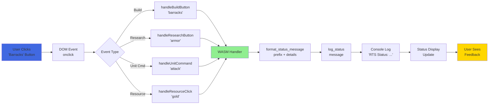
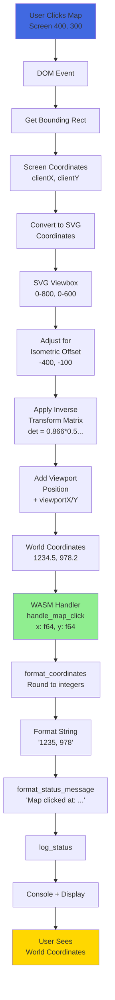
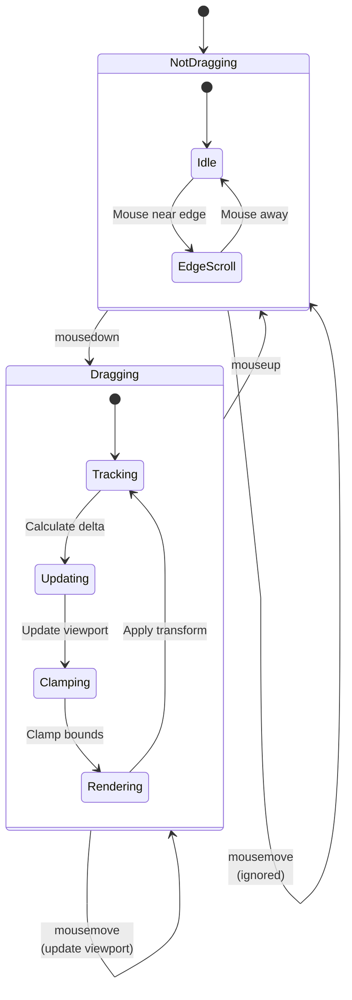
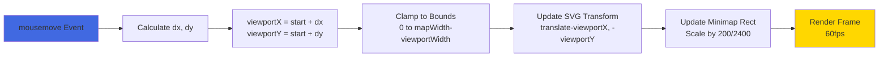
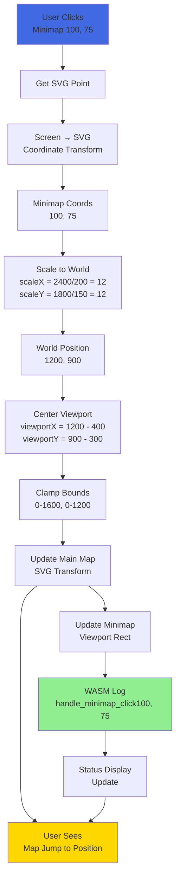
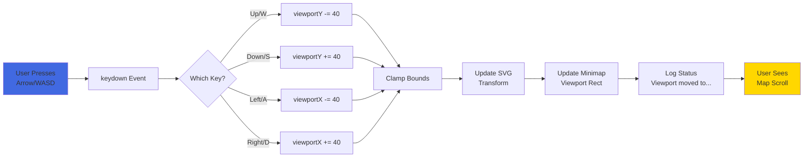
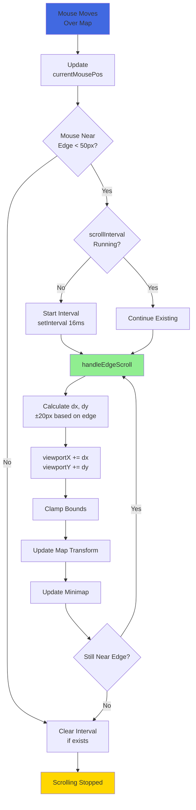
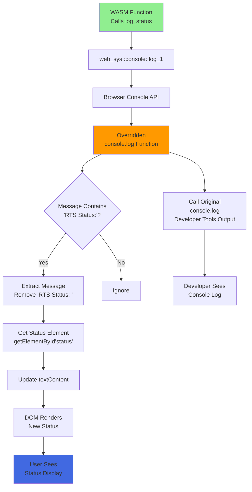
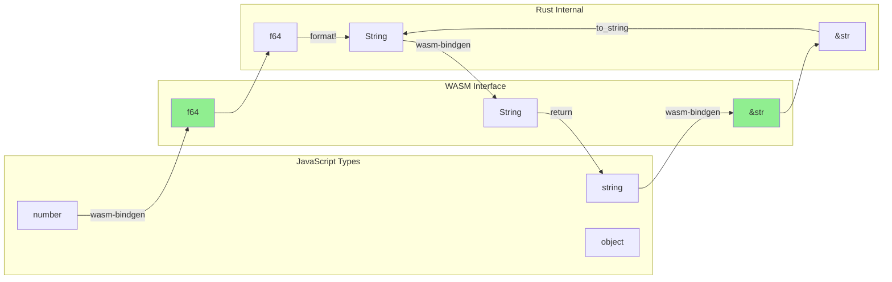

# Data Flow

This page documents how data flows through the RTS Mock system, from user input to visual output.

## 📊 Overall Data Flow



---

## 1️⃣ Button Click Data Flow

Simple, synchronous data pipeline for button interactions.



### Data Transformation

1. **Input:** Button ID string (e.g., `"barracks"`)
2. **Processing:** Concatenate with prefix (e.g., `"Build: barracks selected"`)
3. **Output:** Formatted status message in UI

**Example:**
```
Input:  "barracks"
        ↓
Format: "Build: " + "barracks" + " selected"
        ↓
Log:    "RTS Status: Build: barracks selected"
        ↓
Display: "Build: barracks selected"
```

---

## 2️⃣ Map Click Data Flow

Complex coordinate transformation pipeline.



### Coordinate Spaces

| Space | Range | Purpose |
|-------|-------|---------|
| **Screen** | Pixel coordinates | Mouse position |
| **SVG** | 0-800 × 0-600 | SVG viewBox |
| **Isometric** | Adjusted for transform | 3D projection |
| **World** | 0-2400 × 0-1800 | Actual map position |

### Transformation Formula

```javascript
// Screen → SVG
svgX = (screenX / rect.width) * 800
svgY = (screenY / rect.height) * 600

// SVG → Adjusted
adjustedX = svgX - 400
adjustedY = svgY - 100

// Inverse Isometric Transform
det = 0.866 * 0.5 - 0.5 * (-0.866)
worldX = ((0.5 * adjustedX) - (-0.866 * adjustedY)) / det + viewportX
worldY = ((-0.5 * adjustedX) + (0.866 * adjustedY)) / det + viewportY
```

---

## 3️⃣ Map Drag State Flow

State management for viewport panning.



### State Variables

```javascript
// Dragging state
let isDragging = false;
let dragStart = { x: 0, y: 0 };        // Initial mouse position
let viewportStart = { x: 0, y: 0 };    // Initial viewport position

// Map state
const mapState = {
    mapWidth: 2400,
    mapHeight: 1800,
    viewportWidth: 800,
    viewportHeight: 600,
    viewportX: 800,      // Current X position
    viewportY: 600       // Current Y position
};
```

### Data Updates Per Frame



---

## 4️⃣ Minimap Click Flow

Bidirectional coordinate scaling between minimap and main map.



### Scaling Factors

**Minimap → World:**
```javascript
scaleX = mapWidth / minimapWidth     // 2400 / 200 = 12
scaleY = mapHeight / minimapHeight   // 1800 / 150 = 12

worldX = minimapX * scaleX
worldY = minimapY * scaleY
```

**World → Minimap:**
```javascript
minimapX = worldX / scaleX
minimapY = worldY / scaleY
```

---

## 5️⃣ Keyboard Navigation Flow

Discrete viewport updates from keyboard input.



### Movement Delta

| Key | Direction | Delta | New Position |
|-----|-----------|-------|--------------|
| ↑/W | Up | y -= 40 | viewportY - 40 |
| ↓/S | Down | y += 40 | viewportY + 40 |
| ←/A | Left | x -= 40 | viewportX - 40 |
| →/D | Right | x += 40 | viewportX + 40 |

---

## 6️⃣ Edge Scroll Continuous Flow

Interval-based continuous updates.



### Scroll Parameters

```javascript
const edgeThreshold = 50;      // Pixels from edge
const scrollSpeed = 20;        // Pixels per frame
const intervalMs = 16;         // ~60fps

// Calculate scroll direction
let dx = 0, dy = 0;
if (mouseX < edgeThreshold) dx = -scrollSpeed;
if (mouseX > width - edgeThreshold) dx = scrollSpeed;
if (mouseY < edgeThreshold) dy = -scrollSpeed;
if (mouseY > height - edgeThreshold) dy = scrollSpeed;
```

---

## 7️⃣ Status Message Flow

Console override intercepts and routes messages.



### Message Formatting Pipeline

```rust
// In WASM (Rust)
fn handle_build_button(building_type: &str) {
    // Step 1: Format details
    let details = format!("{} selected", building_type);
    // "barracks selected"

    // Step 2: Add prefix
    let message = format_status_message("Build", &details);
    // "Build: barracks selected"

    // Step 3: Log with "RTS Status:" prefix
    log_status(&message);
    // console.log("RTS Status: Build: barracks selected")
}
```

```javascript
// In JavaScript
console.log = function(message) {
    originalLog(message);  // "RTS Status: Build: barracks selected"

    if (message.includes('RTS Status:')) {
        const cleanMessage = message.replace('RTS Status: ', '');
        // "Build: barracks selected"

        statusEl.textContent = cleanMessage;
        // Updates DOM
    }
};
```

---

## 🔄 Data Type Transformations

### Type Conversions Across Layers



### Example: Map Click Coordinates

```javascript
// JavaScript → WASM
handle_map_click(1234.567, 890.123)  // JS numbers
```

```rust
// WASM receives
pub fn handle_map_click(x: f64, y: f64)  // Rust f64
{
    let coords = format_coordinates(x, y);  // → String
    // "(1235, 890)"

    let message = format_status_message("Map clicked at", &coords);  // → String
    // "Map clicked at: (1235, 890)"

    log_status(&message);  // &str passed to console
}
```

```javascript
// JavaScript receives
console.log("RTS Status: Map clicked at: (1235, 890)")  // JS string
```

---

## 📦 Data Persistence

### Current State

❌ **No Persistent Storage**
- All data is ephemeral
- Page reload resets everything
- No save/load functionality

### State Lifetime

| Data | Lifetime | Storage |
|------|----------|---------|
| **Viewport Position** | Until page reload | JavaScript memory |
| **Dragging State** | During drag operation | JavaScript memory |
| **Status Messages** | Until next interaction | DOM textContent |
| **Console Logs** | Until cleared | Browser console |

### Future Considerations

If this were a real game:
- **LocalStorage:** Save game state, settings
- **IndexedDB:** Large data (map state, units)
- **Server Sync:** Multiplayer synchronization
- **Session Storage:** Temporary data

---

## 🔗 Related Pages

- **[Architecture](Architecture)** - System design
- **[Interaction Flows](Interaction-Flows)** - Sequence diagrams
- **[Components](Components)** - Component details
- **[Development Guide](Development-Guide)** - Implementation

---

[← Back to Home](Home)
