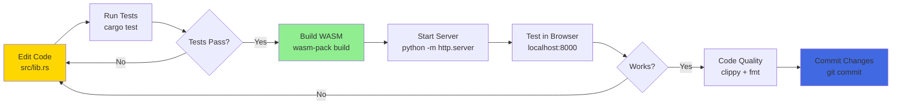

# Development Guide

Complete guide for setting up, building, and contributing to the RTS Mock project.

## 🚀 Quick Start

```bash
# 1. Clone the repository
git clone https://github.com/softwarewrighter/rts_mock.git
cd rts_mock

# 2. Build WASM package
wasm-pack build --target web --out-dir pkg

# 3. Serve locally
python -m http.server 8000

# 4. Open in browser
# Navigate to http://localhost:8000
```

---

## 📋 Prerequisites

### Required Tools

| Tool | Version | Purpose | Installation |
|------|---------|---------|--------------|
| **Rust** | 1.70+ | Compile Rust code | [rustup.rs](https://rustup.rs/) |
| **wasm-pack** | Latest | Build WASM packages | `cargo install wasm-pack` |
| **HTTP Server** | Any | Serve static files | Python, Node.js, or other |

### Optional Tools

| Tool | Purpose |
|------|---------|
| **cargo-watch** | Auto-rebuild on file changes |
| **wasm-bindgen-cli** | Manual WASM binding generation |
| **Firefox/Chrome** | WASM test execution |

---

## 🔧 Installation

### 1. Install Rust

```bash
# Install rustup (Rust toolchain installer)
curl --proto '=https' --tlsv1.2 -sSf https://sh.rustup.rs | sh

# Add wasm32 target
rustup target add wasm32-unknown-unknown

# Verify installation
rustc --version
cargo --version
```

### 2. Install wasm-pack

```bash
# Install wasm-pack
cargo install wasm-pack

# Verify installation
wasm-pack --version
```

### 3. Clone Repository

```bash
git clone https://github.com/softwarewrighter/rts_mock.git
cd rts_mock
```

---

## 🏗️ Build Process

### Standard Build

```bash
# Build for web target
wasm-pack build --target web --out-dir pkg
```

**Output:**
- `pkg/rts_mock_bg.wasm` - WASM binary
- `pkg/rts_mock.js` - JavaScript glue code
- `pkg/rts_mock.d.ts` - TypeScript definitions
- `pkg/package.json` - NPM package metadata

### Build Options

```bash
# Development build (with debug symbols)
wasm-pack build --dev --target web --out-dir pkg

# Release build (optimized, smaller)
wasm-pack build --release --target web --out-dir pkg

# Profile build (optimized with debug info)
wasm-pack build --profiling --target web --out-dir pkg
```

### Build Targets

```bash
# Web (ES modules, default)
wasm-pack build --target web

# Node.js
wasm-pack build --target nodejs

# Bundler (Webpack, Rollup)
wasm-pack build --target bundler

# No modules
wasm-pack build --target no-modules
```

---

## 🧪 Testing

### Run Unit Tests

```bash
# Run all unit tests
cargo test

# Run with output
cargo test -- --nocapture

# Run specific test
cargo test test_format_coordinates

# Watch mode (with cargo-watch)
cargo watch -x test
```

### Run WASM Tests

```bash
# Firefox (headless)
wasm-pack test --headless --firefox

# Chrome (headless)
wasm-pack test --headless --chrome

# With output
wasm-pack test --headless --firefox -- --nocapture

# Interactive mode (opens browser)
wasm-pack test --firefox
```

See **[Testing](Testing)** for detailed test documentation.

---

## 🎨 Code Quality

### Linting

```bash
# Run clippy (Rust linter)
cargo clippy

# Fix automatically
cargo clippy --fix

# Strict mode
cargo clippy -- -D warnings
```

### Formatting

```bash
# Check formatting
cargo fmt -- --check

# Auto-format code
cargo fmt

# Watch mode
cargo watch -x fmt
```

### Common Clippy Warnings

```bash
# Allow specific warnings
#[allow(clippy::unnecessary_wraps)]

# Deny specific warnings
#[deny(clippy::unwrap_used)]
```

---

## 📁 Project Structure

```
rts_mock/
├── src/
│   ├── lib.rs              # Main WASM module ⚡
│   └── main.rs             # Unused CLI entry
│
├── pkg/                    # Generated WASM output 🏗️
│   ├── rts_mock_bg.wasm    # WASM binary
│   ├── rts_mock.js         # JS glue code
│   ├── rts_mock.d.ts       # TypeScript defs
│   └── package.json        # NPM metadata
│
├── docs/                   # Documentation 📚
│   ├── overview.md
│   └── claude-web-research-preview-notes.md
│
├── wiki/                   # GitHub Wiki pages 📖
│   ├── Home.md
│   ├── Architecture.md
│   └── ...
│
├── index.html              # Complete UI 🎨
├── Cargo.toml              # Rust dependencies
├── Cargo.lock              # Dependency lock file
├── CLAUDE.md               # AI assistant guidance
├── README.md               # User documentation
├── LICENSE                 # MIT License
└── .gitignore              # Git ignore rules
```

---

## 🔄 Development Workflow

### Recommended Workflow



### Example Session

```bash
# 1. Make changes to lib.rs
vim src/lib.rs

# 2. Run tests
cargo test

# 3. Build WASM
wasm-pack build --target web --out-dir pkg

# 4. Serve (in separate terminal)
python -m http.server 8000

# 5. Test in browser
open http://localhost:8000

# 6. Code quality
cargo clippy
cargo fmt

# 7. Commit
git add src/lib.rs
git commit -m "Add new feature"
```

---

## 🔨 Common Development Tasks

### Adding a New Button Handler

**1. Add handler function in `src/lib.rs`:**

```rust
#[wasm_bindgen]
pub fn handle_new_button(param: &str) {
    let message = format_status_message("New Button", param);
    log_status(&message);
}
```

**2. Add button in `index.html`:**

```html
<button class="menu-button" onclick="handleNewButton('value')">
    New Button
</button>
```

**3. Export function in JavaScript:**

```javascript
import init, { handle_new_button } from './pkg/rts_mock.js';

// Later in run()
window.handleNewButton = handle_new_button;
```

**4. Add test in `src/lib.rs`:**

```rust
#[cfg(all(test, target_arch = "wasm32"))]
mod wasm_tests {
    #[wasm_bindgen_test]
    fn test_handle_new_button_wasm() {
        handle_new_button("test");
    }
}
```

**5. Build and test:**

```bash
cargo test
wasm-pack build --target web --out-dir pkg
```

### Adding a New Helper Function

**1. Add function (non-public):**

```rust
fn new_helper_function(input: &str) -> String {
    format!("Processed: {}", input)
}
```

**2. Add unit test:**

```rust
#[cfg(test)]
mod tests {
    #[test]
    fn test_new_helper_function() {
        let result = new_helper_function("test");
        assert_eq!(result, "Processed: test");
    }
}
```

**3. Test:**

```bash
cargo test
```

### Updating Dependencies

```bash
# Update all dependencies
cargo update

# Update specific dependency
cargo update wasm-bindgen

# Check for outdated dependencies (requires cargo-outdated)
cargo outdated
```

---

## 🐛 Debugging

### Debug WASM in Browser

**1. Enable source maps:**

Build with debug mode:
```bash
wasm-pack build --dev --target web --out-dir pkg
```

**2. Open browser DevTools:**
- Chrome: F12 → Sources tab
- Firefox: F12 → Debugger tab

**3. Find WASM source:**
- Navigate to `webpack://` or similar
- Find `rts_mock_bg.wasm`
- Set breakpoints

### Console Logging

**Add debug logging:**

```rust
use web_sys::console;

#[wasm_bindgen]
pub fn debug_function(x: f64) {
    console::log_1(&format!("Debug: x = {}", x).into());
}
```

**View in browser console:**
- Chrome: F12 → Console
- Firefox: F12 → Console

### Common Issues

**Issue: WASM file not loading**
```
Solution: Ensure HTTP server is running and serving from project root
```

**Issue: "cannot import module"**
```
Solution: Check that <script type="module"> is used in index.html
```

**Issue: Functions not found**
```
Solution: Rebuild WASM with wasm-pack build
```

---

## 📦 Deployment

### Static Hosting

**GitHub Pages:**

```bash
# Build WASM
wasm-pack build --release --target web --out-dir pkg

# Create gh-pages branch
git checkout -b gh-pages

# Commit pkg/ (remove from .gitignore first)
git add index.html pkg/
git commit -m "Deploy to GitHub Pages"

# Push
git push origin gh-pages
```

**Netlify/Vercel:**

1. Build command: `wasm-pack build --release --target web --out-dir pkg`
2. Publish directory: `/`
3. Deploy

**Custom Server:**

```bash
# Copy files to server
scp -r index.html pkg/ user@server:/var/www/rts_mock/

# Configure nginx
server {
    listen 80;
    server_name example.com;
    root /var/www/rts_mock;

    location / {
        try_files $uri $uri/ =404;
    }

    # Enable WASM MIME type
    types {
        application/wasm wasm;
    }
}
```

---

## 🤝 Contributing

### Code Style

**Rust:**
- Follow Rust standard style (`cargo fmt`)
- Use meaningful variable names
- Add comments for complex logic
- Keep functions small and focused

**JavaScript:**
- Use camelCase for variables
- Add JSDoc comments
- Prefer const over let

**HTML/CSS:**
- Maintain inline styling (project convention)
- Use semantic HTML
- Keep retro terminal aesthetic

### Commit Messages

```bash
# Good commit messages
git commit -m "Add minimap click handler"
git commit -m "Fix coordinate transformation bug"
git commit -m "Update documentation for testing"

# Bad commit messages
git commit -m "fix stuff"
git commit -m "updates"
git commit -m "WIP"
```

### Pull Request Process

1. **Fork the repository**
2. **Create feature branch:** `git checkout -b feature/my-feature`
3. **Make changes and test:** `cargo test && wasm-pack test --headless --firefox`
4. **Code quality:** `cargo clippy && cargo fmt`
5. **Commit changes:** `git commit -m "Add my feature"`
6. **Push to fork:** `git push origin feature/my-feature`
7. **Open Pull Request** on GitHub

---

## 🔗 Resources

### Official Documentation

- [Rust Book](https://doc.rust-lang.org/book/)
- [wasm-bindgen Guide](https://rustwasm.github.io/wasm-bindgen/)
- [wasm-pack Docs](https://rustwasm.github.io/wasm-pack/)
- [web-sys Docs](https://rustwasm.github.io/wasm-bindgen/api/web_sys/)

### Related Pages

- **[Architecture](Architecture)** - System design
- **[Testing](Testing)** - Testing guide
- **[API Reference](API-Reference)** - Function docs
- **[Components](Components)** - Component details

---

[← Back to Home](Home)
