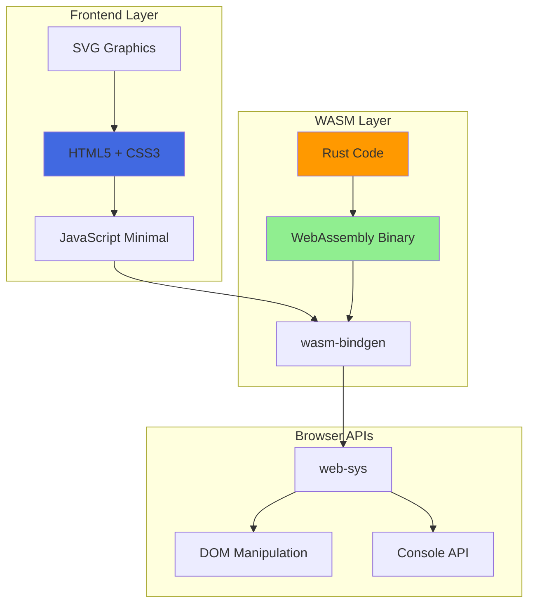

# RTS Mock - Wiki Home

Welcome to the **RTS Mock** project wiki! This is a comprehensive technical documentation hub for the web-based Real-Time Strategy (RTS) game UI mockup built with Rust and WebAssembly.

## 📋 Quick Navigation

### Core Documentation
- **[Architecture](Architecture)** - System architecture, technology stack, and design patterns
- **[Components](Components)** - Detailed breakdown of all UI components
- **[Interaction Flows](Interaction-Flows)** - Sequence diagrams and user interaction patterns
- **[Data Flow](Data-Flow)** - How data moves through the system
- **[Testing Strategy](Testing)** - Unit tests, WASM tests, and testing approach

### Developer Resources
- **[Development Guide](Development-Guide)** - Setup, build, and contribution guidelines
- **[API Reference](API-Reference)** - WASM-exposed functions and interfaces

---

## 🎯 Project Overview

**RTS Mock** is a demonstration project showcasing a classic Real-Time Strategy game interface without actual game logic. It's purely a UI prototype with interactive elements designed to demonstrate:

- **Rust + WebAssembly** integration for high-performance web applications
- **Interactive SVG-based graphics** for scalable game interfaces
- **Clean architectural separation** between logic and presentation
- **Retro terminal aesthetic** with green-on-black color scheme

### Key Features

✅ **Interactive UI Components**
- Resource panel (Gold, Wood, Stone, Food, Population)
- Interactive main map with SVG terrain, buildings, and units
- Minimap with viewport indicator and click-to-navigate
- Build menu (8 building types)
- Research menu (7 technologies)
- Unit control panel (Move, Attack, Patrol, Stop)

✅ **Map Interaction**
- Isometric 3D-style main map
- 2D top-down minimap
- Coordinate conversion between map systems
- Scrollable viewport with edge scrolling
- Keyboard navigation (WASD/Arrow keys)

✅ **Code Quality**
- Comprehensive unit tests (4 tests)
- WASM-specific browser tests (5 tests)
- Linting with `cargo clippy`
- Formatted with `cargo fmt`

---

## 🏗️ Technology Stack



### Core Technologies

| Technology | Purpose | Version/Edition |
|------------|---------|-----------------|
| **Rust** | Core interaction logic | Edition 2021 |
| **wasm-bindgen** | Rust/JavaScript interop | Latest |
| **web-sys** | Browser API bindings | Latest |
| **WebAssembly** | High-performance execution | - |
| **HTML5/CSS3** | UI layout and styling | - |
| **SVG** | Vector graphics rendering | - |

---

## 🚀 Quick Start

```bash
# Clone the repository
git clone https://github.com/softwarewrighter/rts_mock.git
cd rts_mock

# Build WASM package
wasm-pack build --target web --out-dir pkg

# Serve locally
python -m http.server 8000

# Open in browser
# Navigate to http://localhost:8000
```

See **[Development Guide](Development-Guide)** for detailed setup instructions.

---

## 📊 Project Status

**Current Version:** v0.1.0 (UI Mockup)
**Last Updated:** November 2025
**Status:** ✅ Active Development

### Recent Updates

- ✅ Added footer with copyright, license, and GitHub links
- ✅ Implemented comprehensive test suite
- ✅ Fixed coordinate system alignment between maps
- ✅ Added RTS-style scrolling and minimap integration
- ✅ Documented architecture and components

### Roadmap

See our **[Roadmap](Roadmap)** page for planned features and enhancements.

---

## 📖 Documentation Structure

This wiki is organized into the following sections:

1. **[Architecture](Architecture)** - High-level system design and patterns
2. **[Components](Components)** - Individual UI component documentation
3. **[Interaction Flows](Interaction-Flows)** - User interaction sequences
4. **[Data Flow](Data-Flow)** - Data movement and transformations
5. **[Testing](Testing)** - Testing strategy and test cases
6. **[Development Guide](Development-Guide)** - How to build and contribute
7. **[API Reference](API-Reference)** - Function signatures and usage

---

## 🤝 Contributing

This is a demonstration project, but contributions are welcome! Please see the **[Development Guide](Development-Guide)** for:

- Code style guidelines
- Testing requirements
- Pull request process
- Development workflow

---

## 📜 License

This project is licensed under the **MIT License**.

Copyright © 2025 Michael A. Wright

See [LICENSE](https://github.com/softwarewrighter/rts_mock/blob/main/LICENSE) for full details.

---

## 🔗 External Links

- **[GitHub Repository](https://github.com/softwarewrighter/rts_mock)**
- **[Issues & Bug Reports](https://github.com/softwarewrighter/rts_mock/issues)**
- **[Pull Requests](https://github.com/softwarewrighter/rts_mock/pulls)**

---

**Need help?** Check the **[FAQ](FAQ)** or open an issue on GitHub!
