# Interaction Flows

This page documents the user interaction flows and sequences in the RTS Mock project using UML-style sequence diagrams.

## 📊 Overview

All user interactions follow a consistent event-driven pattern:


---

## 1️⃣ Application Initialization Flow

The application must initialize WASM before any interactions can occur.


### Key Initialization Steps

1. **Load Static Assets** (HTML, CSS, SVG)
2. **Load WASM Module** (`init()`)
3. **Import WASM Functions** (handle_map_click, etc.)
4. **Setup Event Listeners** (click, mousedown, mousemove, keydown)
5. **Override console.log** (to update status display)
6. **Initialize Map View** (center viewport)
7. **Make Functions Global** (attach to `window` object)

---

## 2️⃣ Simple Button Click Flow

Basic interaction pattern for build, research, and unit control buttons.

### Build Button Click


### Research Button Click


### Unit Command Click


---

## 3️⃣ Map Click Flow (Complex)

Map clicks involve coordinate transformation from screen space to world space.

```mermaid
sequenceDiagram
    actor User
    participant MapSVG
    participant DOM
    participant JS
    participant WASM
    participant Helper
    participant Console
    participant Status

    User->>MapSVG: Click at screen (400, 300)
    MapSVG->>DOM: click event
    DOM->>JS: Event listener triggered
    JS->>JS: Get SVG bounding rect
    JS->>JS: screen → SVG coords<br/>(400, 300) → (400, 300)
    JS->>JS: SVG → Viewport coords<br/>Adjust for (400, 100) offset
    JS->>JS: Apply inverse isometric transform<br/>matrix(0.866, 0.5, -0.866, 0.5, ...)
    JS->>JS: Viewport → World coords<br/>Add viewport position
    JS->>WASM: handle_map_click(1234.5, 978.2)
    WASM->>Helper: format_coordinates(1234.5, 978.2)
    Helper-->>WASM: "(1235, 978)"
    WASM->>Helper: format_status_message("Map clicked at", "(1235, 978)")
    Helper-->>WASM: "Map clicked at: (1235, 978)"
    WASM->>Console: log_status("Map clicked at: (1235, 978)")
    Console->>Status: Update display
    Status-->>User: Show coordinates

    Note over User,Status: Complex coordinate transformation
```



### Coordinate Transformation Steps

1. **Screen Coordinates** - Raw pixel position from click event
2. **SVG Coordinates** - Normalized to SVG viewBox (800×600)
3. **Adjusted Coordinates** - Account for isometric transform offset
4. **Inverse Transform** - Reverse the isometric matrix
5. **World Coordinates** - Add viewport position for final coords

---

## 4️⃣ Map Dragging Flow

Dragging updates viewport position to pan across the larger world map.


### State Management

JavaScript manages dragging state:
- `isDragging`: boolean
- `dragStart`: {x, y} - initial mouse position
- `viewportStart`: {x, y} - initial viewport position
- `mapState.viewportX/Y`: current viewport position

---

## 5️⃣ Minimap Click Flow

Clicking minimap centers the main map viewport on the clicked position.


---

## 6️⃣ Edge Scrolling Flow

Moving mouse near edge triggers continuous scrolling.


### Edge Scroll Parameters

- **Threshold:** 50px from edge
- **Speed:** 20px per frame
- **Frequency:** Every 16ms (~60fps)
- **Edges:** All four (top, bottom, left, right)

---

## 7️⃣ Keyboard Navigation Flow

Arrow keys or WASD scroll the map.


### Keyboard Mappings

| Key | Direction | Delta |
|-----|-----------|-------|
| ↑ or W | Up | viewportY -= 40 |
| ↓ or S | Down | viewportY += 40 |
| ← or A | Left | viewportX -= 40 |
| → or D | Right | viewportX += 40 |

---

## 8️⃣ Resource Panel Click Flow

```mermaid
sequenceDiagram
    actor User
    participant ResourceDiv
    participant WASM
    participant Helper
    participant Console
    participant Status

    User->>ResourceDiv: Click "💰 Gold: 1500"
    ResourceDiv->>WASM: handle_resource_click('gold')
    WASM->>Helper: format_status_message('Resource panel clicked', 'gold')
    Helper-->>WASM: 'Resource panel clicked: gold'
    WASM->>Console: log_status('Resource panel clicked: gold')
    Console->>Status: Update textContent
    Status-->>User: Display status

    Note over User,Status: Simple click → log pattern
```



---

## 9️⃣ Console Log Override Flow

The application overrides `console.log` to update the status display.


### Implementation

```javascript
// Override console.log
const originalLog = console.log;
console.log = function(message) {
    originalLog(message);  // Still log to console
    const statusEl = document.getElementById('status');
    if (statusEl && typeof message === 'string' && message.includes('RTS Status:')) {
        statusEl.textContent = message.replace('RTS Status: ', '');
    }
};
```

---

## 🔄 Complete Interaction Summary


---

## ⚡ Performance Characteristics

### Latency Breakdown

| Interaction | Layers | Estimated Latency |
|------------|--------|------------------|
| **Button Click** | DOM → JS → WASM → Console | < 5ms |
| **Map Click** | DOM → Coord Transform → WASM | < 10ms |
| **Map Drag** | DOM → JS State → SVG Transform | < 2ms per frame |
| **Edge Scroll** | Timer → JS State → SVG Transform | 16ms (60fps) |
| **Keyboard** | DOM → JS State → SVG Transform | < 5ms |
| **Minimap Click** | DOM → Coord Scale → Map Update | < 10ms |

### Bottlenecks

✅ **Fast:**
- WASM function calls (native speed)
- SVG transforms (GPU accelerated)
- Event propagation

⚠️ **Potential Issues:**
- Many simultaneous SVG element updates (not currently an issue)
- Complex coordinate transformations (optimized with inverse matrix)

---

## 🔗 Related Pages

- **[Components](Components)** - Component details
- **[Architecture](Architecture)** - System architecture
- **[Data Flow](Data-Flow)** - Data movement patterns
- **[Development Guide](Development-Guide)** - Implementation details

---

[← Back to Home](Home)
