# Testing Strategy

This page documents the testing approach, test structure, and test cases for the RTS Mock project.

## 🧪 Testing Overview

The project uses a dual testing strategy:
1. **Unit Tests** - Standard Rust tests for helper functions
2. **WASM Tests** - Browser-based tests for WASM-exposed functions


---

## 📋 Test Structure

### File Organization

```rust
// src/lib.rs

// Production code
fn format_status_message(...) { ... }
pub fn handle_map_click(...) { ... }

// Unit tests (always compiled for test)
#[cfg(test)]
mod tests {
    #[test]
    fn test_format_status_message() { ... }
}

// WASM tests (only for wasm32 target)
#[cfg(all(test, target_arch = "wasm32"))]
mod wasm_tests {
    #[wasm_bindgen_test]
    fn test_handle_map_click_wasm() { ... }
}
```

### Test Commands

```bash
# Run unit tests (fast, no browser needed)
cargo test

# Run WASM tests (requires browser)
wasm-pack test --headless --firefox

# Run WASM tests in Chrome
wasm-pack test --headless --chrome

# Run with output
cargo test -- --nocapture
```

---

## 1️⃣ Unit Tests

### Purpose
Test pure helper functions that don't require browser APIs.

### Test Cases

#### Test: `test_format_status_message`

**Location:** `src/lib.rs:70-73`

```rust
#[test]
fn test_format_status_message() {
    let result = format_status_message("Test", "message");
    assert_eq!(result, "Test: message");
}
```

**What it tests:**
- String concatenation with colon separator
- Correct formatting of prefix + details

#### Test: `test_format_coordinates`

**Location:** `src/lib.rs:75-79`

```rust
#[test]
fn test_format_coordinates() {
    let result = format_coordinates(123.45, 678.90);
    assert_eq!(result, "(123, 679)");
}
```

**What it tests:**
- Rounding to nearest integer
- Proper formatting with parentheses and comma

#### Test: `test_format_coordinates_zero`

**Location:** `src/lib.rs:81-85`

```rust
#[test]
fn test_format_coordinates_zero() {
    let result = format_coordinates(0.0, 0.0);
    assert_eq!(result, "(0, 0)");
}
```

**What it tests:**
- Edge case: zero coordinates
- Correct handling of special values

#### Test: `test_format_coordinates_negative`

**Location:** `src/lib.rs:87-91`

```rust
#[test]
fn test_format_coordinates_negative() {
    let result = format_coordinates(-10.5, -20.8);
    assert_eq!(result, "(-10, -21)");
}
```

**What it tests:**
- Negative coordinate handling
- Correct rounding for negative values

### Unit Test Summary

| Test | Input | Expected Output | Status |
|------|-------|----------------|--------|
| `test_format_status_message` | "Test", "message" | "Test: message" | ✅ Pass |
| `test_format_coordinates` | 123.45, 678.90 | "(123, 679)" | ✅ Pass |
| `test_format_coordinates_zero` | 0.0, 0.0 | "(0, 0)" | ✅ Pass |
| `test_format_coordinates_negative` | -10.5, -20.8 | "(-10, -21)" | ✅ Pass |

---

## 2️⃣ WASM Tests

### Purpose
Test WASM-exposed functions in actual browser environment.

### Configuration

```rust
#[cfg(all(test, target_arch = "wasm32"))]
mod wasm_tests {
    use wasm_bindgen_test::*;

    wasm_bindgen_test_configure!(run_in_browser);
    // Tests run in actual browser context
}
```

### Test Cases

#### Test: `test_greet_wasm`

**Location:** `src/lib.rs:103-108`

```rust
#[wasm_bindgen_test]
fn test_greet_wasm() {
    greet("WASM");
    // Note: This test will trigger an alert in the browser
}
```

**What it tests:**
- WASM function can call browser `alert()` API
- Basic WASM-JS interop works

**Limitation:** Alert is visible in browser (would need mocking for real tests)

#### Test: `test_handle_map_click_wasm`

**Location:** `src/lib.rs:110-115`

```rust
#[wasm_bindgen_test]
fn test_handle_map_click_wasm() {
    handle_map_click(100.0, 200.0);
    // This test verifies the function doesn't panic
}
```

**What it tests:**
- Map click handler accepts f64 coordinates
- Function doesn't panic with valid input
- Console logging works (not verified programmatically)

#### Test: `test_handle_build_button_wasm`

**Location:** `src/lib.rs:117-121`

```rust
#[wasm_bindgen_test]
fn test_handle_build_button_wasm() {
    handle_build_button("barracks");
    // This test verifies the function doesn't panic with valid input
}
```

**What it tests:**
- Build button handler accepts string input
- Function doesn't panic with valid building type

#### Test: `test_handle_empty_string_wasm`

**Location:** `src/lib.rs:123-130`

```rust
#[wasm_bindgen_test]
fn test_handle_empty_string_wasm() {
    handle_build_button("");
    handle_research_button("");
    handle_unit_command("");
    handle_resource_click("");
    // Test edge case with empty strings
}
```

**What it tests:**
- All handlers gracefully handle empty string input
- No panics or errors with edge case data

#### Test: `test_coordinate_edge_cases_wasm`

**Location:** `src/lib.rs:132-138`

```rust
#[wasm_bindgen_test]
fn test_coordinate_edge_cases_wasm() {
    handle_map_click(0.0, 0.0);
    handle_map_click(-1.0, -1.0);
    handle_map_click(f64::MAX, f64::MIN);
    // Test edge cases for coordinate handling
}
```

**What it tests:**
- Zero coordinates
- Negative coordinates
- Extreme values (f64::MAX, f64::MIN)
- No panics with edge case coordinates

### WASM Test Summary

| Test | Input | Purpose | Status |
|------|-------|---------|--------|
| `test_greet_wasm` | "WASM" | Browser alert interop | ✅ Pass |
| `test_handle_map_click_wasm` | 100.0, 200.0 | Map click handler | ✅ Pass |
| `test_handle_build_button_wasm` | "barracks" | Build button handler | ✅ Pass |
| `test_handle_empty_string_wasm` | "" (empty) | Empty string edge case | ✅ Pass |
| `test_coordinate_edge_cases_wasm` | Edge values | Extreme coordinates | ✅ Pass |

---

## 🎯 Test Coverage

```mermaid
graph TB
    subgraph "Tested Functions"
        FMT_STATUS[format_status_message<br/>✅ 100% Coverage]
        FMT_COORD[format_coordinates<br/>✅ 100% Coverage]
        LOG[log_status<br/>✅ Tested in WASM]
        MAP_CLICK[handle_map_click<br/>✅ Tested in WASM]
        BUILD[handle_build_button<br/>✅ Tested in WASM]
        RESEARCH[handle_research_button<br/>✅ Tested in WASM]
        UNIT[handle_unit_command<br/>✅ Tested in WASM]
        RESOURCE[handle_resource_click<br/>✅ Tested in WASM]
    end

    subgraph "Untested Functions"
        GREET[greet<br/>⚠️ Only basic test]
        MINI[handle_minimap_click<br/>⚠️ Not tested]
    end

    style FMT_STATUS fill:#90EE90
    style FMT_COORD fill:#90EE90
    style GREET fill:#FFD700
    style MINI fill:#FFD700
```



### Coverage Analysis

| Function | Unit Tests | WASM Tests | Coverage |
|----------|-----------|------------|----------|
| `format_status_message` | ✅ Yes | - | 100% |
| `format_coordinates` | ✅ Yes (3 cases) | - | 100% |
| `log_status` | - | ✅ Indirect | 100% |
| `handle_map_click` | - | ✅ Yes | 80% |
| `handle_minimap_click` | - | ❌ No | 0% |
| `handle_build_button` | - | ✅ Yes | 100% |
| `handle_research_button` | - | ✅ Yes | 100% |
| `handle_unit_command` | - | ✅ Yes | 100% |
| `handle_resource_click` | - | ✅ Yes | 100% |
| `greet` | - | ✅ Basic | 50% |

**Overall Coverage:** ~85%

**Missing:**
- `handle_minimap_click` - No tests
- Coordinate transformation logic - Only tested indirectly

---

## 🔬 Test Execution Flow

### Unit Test Execution


### WASM Test Execution


---

## 🚀 Running Tests

### Quick Reference

```bash
# Run all unit tests
cargo test

# Run unit tests with verbose output
cargo test -- --nocapture

# Run specific test
cargo test test_format_coordinates

# Run WASM tests (Firefox)
wasm-pack test --headless --firefox

# Run WASM tests (Chrome)
wasm-pack test --headless --chrome

# Run WASM tests with console output
wasm-pack test --headless --firefox -- --nocapture
```

### CI/CD Integration

**Recommended GitHub Actions workflow:**

```yaml
name: Tests

on: [push, pull_request]

jobs:
  test:
    runs-on: ubuntu-latest
    steps:
      - uses: actions/checkout@v2
      - uses: actions-rs/toolchain@v1
        with:
          toolchain: stable
      - name: Run unit tests
        run: cargo test
      - name: Install wasm-pack
        run: curl https://rustwasm.github.io/wasm-pack/installer/init.sh -sSf | sh
      - name: Run WASM tests
        run: wasm-pack test --headless --firefox
```

---

## 🔍 Test Best Practices

### ✅ Good Practices

1. **Test Edge Cases**
   - Zero values
   - Negative values
   - Empty strings
   - Extreme values (f64::MAX)

2. **Clear Test Names**
   - `test_format_coordinates_zero` - descriptive
   - `test_handle_empty_string_wasm` - explains what's being tested

3. **Separate Concerns**
   - Unit tests for pure functions
   - WASM tests for browser integration

4. **Fast Feedback**
   - Unit tests run in <1 second
   - Quick iteration cycle

### ⚠️ Limitations

1. **No Output Verification**
   - WASM tests don't verify console output
   - Only check for "no panic"

2. **No Mock Objects**
   - `alert()` actually triggers browser alert
   - No mocking of console or DOM

3. **Minimal Integration Tests**
   - No end-to-end testing
   - No UI interaction testing

---

## 🎯 Future Testing Improvements

### Recommended Additions

1. **Add Mock Console**
   ```rust
   // Mock console for testing output
   struct MockConsole { logs: Vec<String> }
   ```

2. **Test Coordinate Transformations**
   - Test isometric math directly
   - Verify coordinate conversion accuracy

3. **Add Integration Tests**
   - Test full event flow
   - Test map state management

4. **Visual Regression Tests**
   - Screenshot comparison
   - Ensure UI renders correctly

5. **Performance Tests**
   - Benchmark WASM function calls
   - Measure rendering performance

6. **Property-Based Tests**
   ```rust
   #[quickcheck]
   fn coordinates_always_round(x: f64, y: f64) { ... }
   ```

---

## 🔗 Related Pages

- **[Development Guide](Development-Guide)** - Build and run instructions
- **[Architecture](Architecture)** - System design
- **[API Reference](API-Reference)** - Function documentation

---

[← Back to Home](Home)
